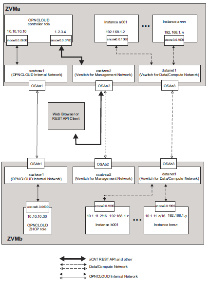

=================
Advanced settings
=================

Flat and VLAN Mixed Network
---------------------------

Above image shows a sample configuration of a flat and VLAN mixed network. To use this
scenario, the following configuration options are needed:

* In the neutron ML2 plugin configure file (default file name is /etc/neutron/plugins/
ml2/ml2_conf.ini), make sure that the flat_networks and network_vlan_ranges property lines read as
follows::

    flat_networks = xcatvsw2
    network_vlan_ranges = datanet1:1:4094

Physical network names will be used as z/VM vswitch names, as follows:
xcatvsw2:
is used by the xCAT Management Network. By default, there is a VLAN UNAWARE Layer 2
vswitch on z/VM with the name xcatvsw2. It is created and configured for xCAT management
network, so you can use xcatvsw2 as in this example.

datanet1:
is used by the OpenStack Data/Compute network. neutron z/VM agent will create a VLAN
AWARE vswitch, with the name datanet1. The range of possible VLAN IDs is from 1 to 4094
(i.e. the complete VLAN ID range).

* In the neutron z/VM agent configure file (default file name is /etc/neutron/plugins/zvm/
neutron_zvm_plugin.ini), the following options are needed::

    [AGENT]
    zvm_xcat_username = mnadmin
    zvm_xcat_password = admin
    zvm_xcat_server = 1.2.3.4
    xcat_zhcp_nodename = zhcp
    [datanet1]
    # OSAa3 uses RDEV A3
    rdev_list=a3

.. note::
    The neutron z/VM agent configuration shown above is for ZVMa. Update the xcat_zhcp_nodename
    option to configure for ZVMb

After restarting the neutron server and neutron z/VM agent, follow these steps on the OpenStack
controller to create the network and subnet for each of the physical networks

* Create the xCAT management network::
    neutron net-create --shared xcat_management --provider:network_type flat
    --provider:physical_network xcatvsw2

* Create the appropriate subnet for xCAT management network, changing the IP range to the
appropriate values according to xCAT configuration::

    neutron subnet-create --allocation-pool start=10.1.0.2,end=10.1.11.254 xcat_management 10.1.0.0/16

* Create the Data/Compute network for physical network datanet1::

    neutron net-create opnstk_datanet1 --provider:network_type vlan --provider:physical_network datanet1

* Create the appropriate subnet for the Data/Compute network opnstk_datanet1::

    neutron subnet-create opnstk_datanet1 192.168.1.0/24

.. note::
    The xCAT Management Network ID should always be passed in the first --nic network_ID
    parameter when creating a new instance with the nova boot command. This restriction ensures that the
    xCAT MN can reach and manage the new instances through the management network.

More Than One Data/Compute Network
----------------------------------

In the current Neutron z/VM agent implementation, physical network names are used as vswitch names.
There is no limitation on the number or the order of physical networks, so in the Neutron ML2 plugin
configuration file (/etc/neutron/plugins/ml2/ml2_conf.ini), you could have::

    flat_networks = xcatvsw2,datanet2
    network_vlan_ranges = datanet1:1:4094,datanet3:1:4094

And in the Neutron z/VM agent configuration file (/etc/neutron/plugins/zvm/neutron_zvm_plugin.ini),
you could have::

    [AGENT]
    zvm_xcat_username = mnadmin
    zvm_xcat_password = admin
    zvm_xcat_server = 1.2.3.4
    xcat_zhcp_nodename = zhcp
    [datanet1]
    # OSAa3 uses RDEV A3
    rdev_list=a3
    [datanet3]
    # OSAa4 uses RDEV A4
    rdev_list=a4
    [datanet2]
    # OSAa5 uses RDEV A5
    rdev_list=a5

In this case, xcatvsw2 will be used by the xCAT Management Network, and datanet1-datanet3 will be
used by Compute/Data Network. The Neutron z/VM agent will create vswitches named datanet1,
datanet2, and datanet3. datanet2 will be a VLAN UNAWARE vswitch, while datanet1 and datanet3 will
be VLAN AWARE.

.. note::
    Each of the switches needs at least one OSA defined. The OSA card needs to be connected to the
    trunk port if the VLAN is enabled. The related rdev_list should be updated to list one of the OSAs.

With datanet2 and datanet3, more Data/Compute networks can be defined, as follows.

* Create the Data/Compute network for physical network datanet2::
    neutron net-create opnstk_datanet2 --provider:network_type flat --provider:physical_network datanet2

* Create the appropriate subnet for the Data/Compute network opnstk_datanet2::

    neutron subnet-create opnstk_datanet2 192.168.2.0/24

* Create the Data/Compute network for physical network datanet3::

    neutron net-create opnstk_datanet3 --provider:network_type vlan --provider:physical_network datanet3

* Create the appropriate subnet for the Data/Compute network opnstk_datanet3::

    neutron subnet-create opnstk_datanet3 192.168.3.0/24

In this example, all Data/Compute networks have gateways defined. If an instance wants to connect to
more than one of the Data/Compute networks, only one gateway is supported. Because opnstk_datanet3
is created later, the gateway of opnstk_datanet3 (192.168.3.1) will be set as the gateway in the instance. To
make the gateway in opnstk_datanet1 the gateway of the instance, add the --no-gateway parameter when
creating opnstk_datanet2 and opnstk_datanet3, as follows::

    neutron subnet-create --no-gateway opnstk_datanet2 192.168.2.0/24
    neutron subnet-create --no-gateway opnstk_datanet3 192.168.3.0/24
