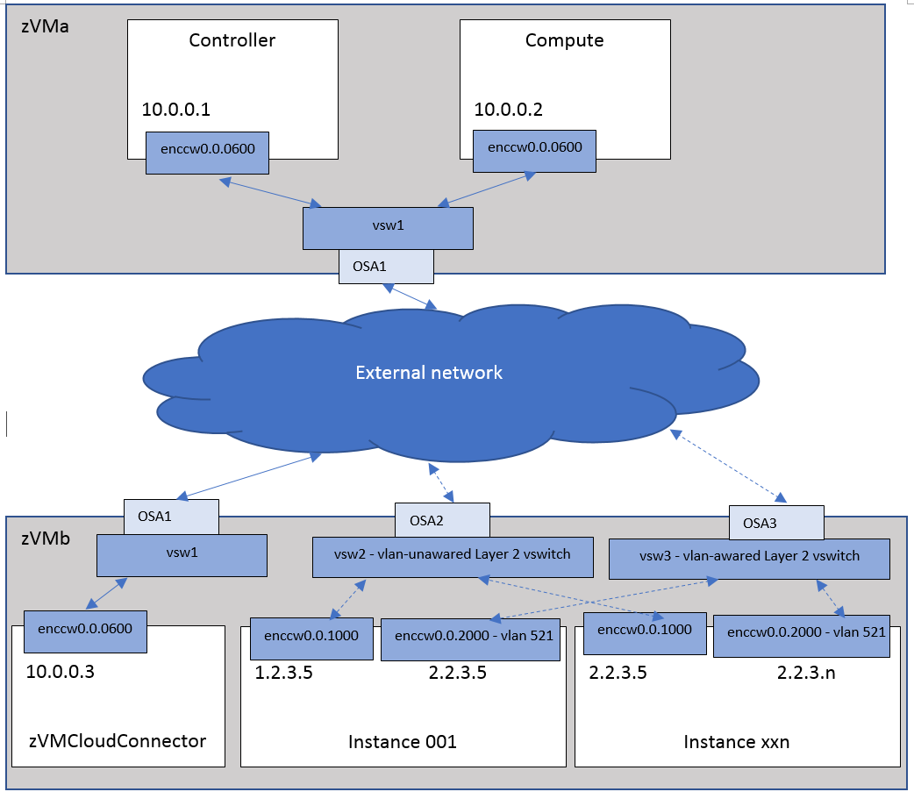

..
      Copyright 2019 IBM
      All Rights Reserved.

      Licensed under the Apache License, Version 2.0 (the "License"); you may
      not use this file except in compliance with the License. You may obtain
      a copy of the License at

          http://www.apache.org/licenses/LICENSE-2.0

      Unless required by applicable law or agreed to in writing, software
      distributed under the License is distributed on an "AS IS" BASIS, WITHOUT
      WARRANTIES OR CONDITIONS OF ANY KIND, either express or implied. See the
      License for the specific language governing permissions and limitations
      under the License.
      
Flat and VLAN Mixed Network
***************************

Above image shows a sample configuration of a flat and VLAN mixed network. To use this
scenario, the following configuration options are needed:

* In the neutron ML2 plugin configure file (default file name is /etc/neutron/plugins/ml2/ml2_conf.ini), make sure that the flat_networks and network_vlan_ranges property lines read as follows::

    flat_networks = vsw2
    network_vlan_ranges = vsw3:1:4094

* In the neutron z/VM agent configure file (default file name is /etc/neutron/plugins/zvm/neutron_zvm_plugin.ini), the following options are needed::

    [AGENT] 
    cloud_connector_url = http:// 10.0.0.3:8080/

After restarting the neutron server and neutron z/VM agent, follow these steps on the OpenStack
controller to create the network and subnet for each of the physical networks

* Create the flat network::

    openstack network create --shared --provider-network_type flat --provider-physical_network vsw2 singleflat2

* Create the appropriate subnet for the flat network::

    Openstack subnet create --allocation-pool start=1.2.3.5,end=1.2.3.254 --network singleflat --subnet-range 1.2.3.0/24 --gateway 1.2.3.1 singleflat-sub 

* Create the vlan network. Enter the following command::

    openstack network create --shared --provider-network_type vlan --provider-physical_network vsw3 --provider-segment 521 vlannet

* Create the appropriate subnet for the vlan network::

    Openstack subnet create --allocation-pool start=2.2.3.5,end=2.2.3.254 --network vlannet --subnet-range 2.2.3.0/24 --gateway 2.2.3.1 vlannet-sub 
