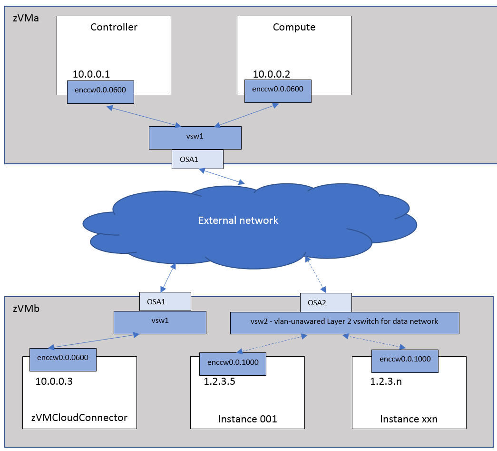

..
      Copyright 2019 IBM
      All Rights Reserved.

      Licensed under the Apache License, Version 2.0 (the "License"); you may
      not use this file except in compliance with the License. You may obtain
      a copy of the License at

          http://www.apache.org/licenses/LICENSE-2.0

      Unless required by applicable law or agreed to in writing, software
      distributed under the License is distributed on an "AS IS" BASIS, WITHOUT
      WARRANTIES OR CONDITIONS OF ANY KIND, either express or implied. See the
      License for the specific language governing permissions and limitations
      under the License.
      
Single Flat Network
*******************

The following scenarios show a single flat network, shows a flat network
that uses public IP addresses, which can be reached from outside the network.

To use this scenario, the following configuration options are needed:

* In the neutron ML2 plugin configure file (default file name is /etc/neutron/plugins/ml2/ml2_conf.ini), make sure that mechanism_drivers is zvm and vsw2 is in the flat_networks option::
   
   [ml2]
   mechanism_drivers = zvm
   [ml2_type_flat]
   flat_networks = vsw2

* In the neutron z/VM agent configure file (default file name is /etc/neutron/plugins/zvm/neutron_zvm_plugin.ini), the option cloud_connector_url is the URL to be used to communicate with the z/VM cloud connector, and if the z/VM cloud connector set auth in wsgi section, a token file is required. Besides, if the vsw2 is not a predefined vswitch, make sure to define rdev_list with the OSA device number::

   [AGENT]
   cloud_connector_url = http:// 10.0.0.3:8080/
   zvm_cloud_connector_token_file = /etc/zvmsdk/token.dat

   [vsw2]
   # OSA2 uses RDEV A2
   rdev_list=a2

After restarting the neutron server and neutron z/VM agent, follow these steps on the OpenStack
controller to create the network and subnet.

* Create the single flat network::

   openstack network create --shared --provider-network_type flat --provider-physical_network vsw2 singleflat
   
* Create the appropriate subnet for the network::

   Openstack subnet create --allocation-pool start=1.2.3.5,end=1.2.3.254 --network singleflat --subnet-range 1.2.3.0/24 --gateway 1.2.3.1 singleflat-sub 
