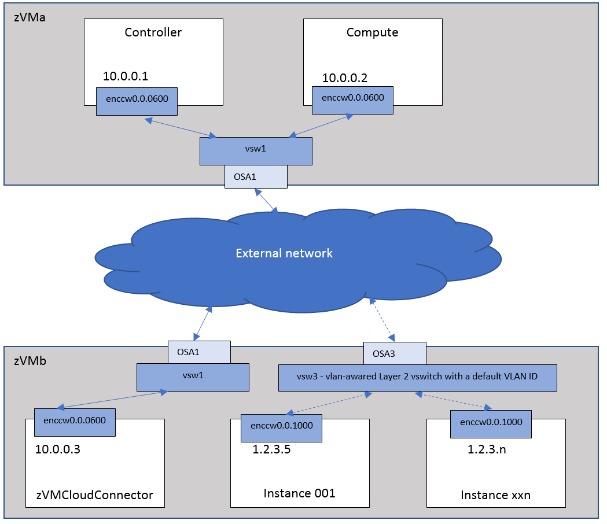
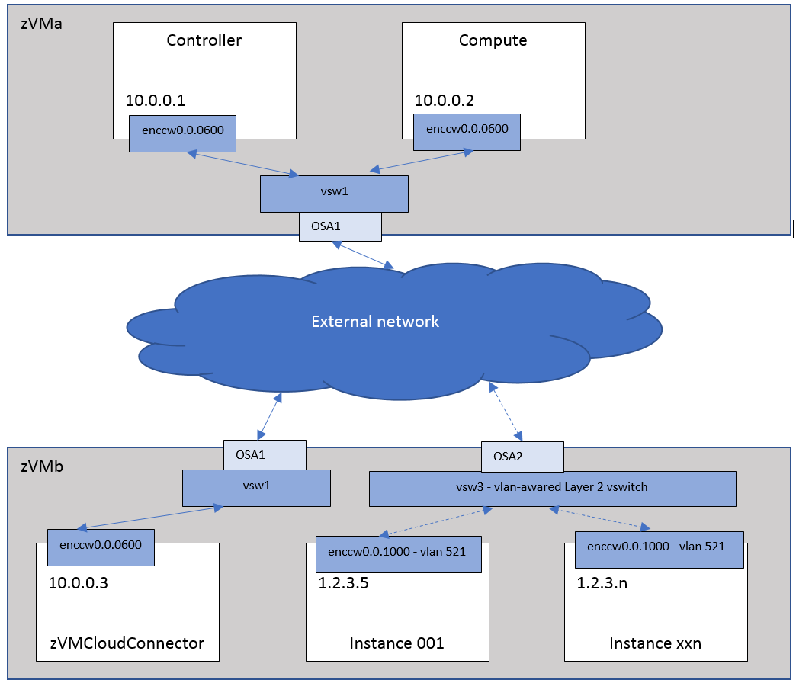

..
      Copyright 2019 IBM
      All Rights Reserved.

      Licensed under the Apache License, Version 2.0 (the "License"); you may
      not use this file except in compliance with the License. You may obtain
      a copy of the License at

          http://www.apache.org/licenses/LICENSE-2.0

      Unless required by applicable law or agreed to in writing, software
      distributed under the License is distributed on an "AS IS" BASIS, WITHOUT
      WARRANTIES OR CONDITIONS OF ANY KIND, either express or implied. See the
      License for the specific language governing permissions and limitations
      under the License.

Single Vlan Network
*******************

Using the Default VLAN ID
=========================

This scenario uses a VLAN aware vswitch and its default (defined in z/VM) VLAN ID. You do not need
to configure any additional information in OpenStack related to the VLAN in the network. To OpenStack
the infrastructure appears the same as in the Flat network scenario. You can configure your vswitch name
to flat_network or network_vlan_ranges. You do not need to configure the VLAN ID for your network
in OpenStack as it appears to OpenStack as a "FLAT" network.

To use this scenario, the following configuration options are needed:

* Specify one of the following options in the neutron ML2 plugin configure file (default file name is /etc/neutron/plugins/ml2/ml2_conf.ini)::

    flat_networks = vsw3
    network_vlan_ranges = vsw3:1:4094

 .. note::
    "vsw3" is used by the z/VM cloud connector, so you should create this as a VLAN aware 
    Layer 2 vswitch with a default VLAN ID defined on z/VM.
    
* In the neutron z/VM agent configure file (default file name is /etc/neutron/plugins/zvm/neutron_zvm_plugin.ini), the following options are needed::

    [AGENT] 
    cloud_connector_url = http:// 10.0.0.3:8080/

Using the User-Specified VLAN ID
================================

This scenario uses a VLAN aware SWITCH with the VLAN ID specified in OpenStack instead of using
the defined default VLAN ID specified for the vswitch in z/VM. The difference between this scenario
and  ``Using the Default VLAN ID`` above is that here the OpenStack user must specify
a VLAN ID for the instances to be deployed.

To use this scenario, the following configuration options are needed:

* In the neutron ML2 plugin configuration file (default file name is /etc/neutron/plugins/ml2/ml2_conf.ini), make sure that the network_vlan_ranges property is specified as follows::

    network_vlan_ranges = vsw3:1:4094

 .. note::
    "vsw3" is used by the z/VM cloud connector. It should be a VLAN aware Layer 2 vswitch on z/VM.

* In the neutron z/VM agent configuration file (default file name is /etc/neutron/plugins/zvm/neutron_zvm_plugin.ini), the following options are needed::
   
    [AGENT] 
    cloud_connector_url = http:// 10.0.0.3:8080/
    [vsw3]
    # OSA2 uses RDEV A3
    rdev_list=a3

After restarting the neutron server and neutron z/VM agent, follow these steps on the OpenStack
controller to create the network and subnet for each of the physical networks.

* Create the vlan network. Enter the following command::

    openstack network create --shared --provider-network_type vlan --provider-physical_network vsw3 --provider-segment 521 vlannet

 .. note::
   The segmentation_id is the VLAN ID. It should be in the range of network_vlan_ranges in /etc/neutron/plugins/ml2/ml2_conf.ini.

* Create the appropriate subnet for the network::

   Openstack subnet create --allocation-pool start=1.2.3.5,end=1.2.3.254 --network vlannet --subnet-range 1.2.3.0/24 --gateway 1.2.3.1 vlannet-sub 

When new instances are spawned, neutron-zvm-agent will set the VLAN ID(521) for each instance.
