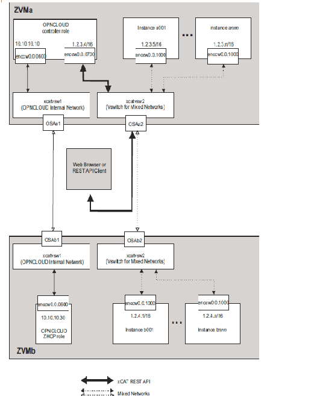

===================
Single Flat Network
===================

The following scenarios show a single flat network, shows a flat network
that uses public IP addresses, which can be reached from outside the network.

Configurations
--------------

To use this scenario, the following configuration options are needed:

* In the neutron ML2 plugin configure file (default file name is /etc/neutron/plugins/ml2/
ml2_conf.ini), make sure that xcatvsw2 is in the flat_networks option::
   flat_networks = xcatvsw2

* In the neutron z/VM agent configure file (default file name is /etc/neutron/plugins/zvm/
neutron_zvm_plugin.ini), the options xcat_mgt_ip and xcat_mgt_mask should be commented out. Also,
make sure that the following options are present ::
   [AGENT]
   zvm_xcat_username = admin
   zvm_xcat_password = admin
   zvm_xcat_server = 1.2.3.4
   xcat_zhcp_nodename = zhcp

.. note::

   * The xcat_mgt_ip and xcat_mgt_mask options are not defined, so the neutron
     z/VM agent will not create a new interface on xCAT MN. The xCAT MN will use
     enccw0.0.0700 to connect to the instances.
   * The neutron z/VM agent configuration shown above is for ZVMa.
     Update the xcat_zhcp_nodename option to configure for ZVMb.

After restarting the neutron server and neutron z/VM agent, follow these steps on the OpenStack
controller to create the network and subnet.

* Create the single flat network::
   neutron net-create --shared singleflat --provider:network_type flat
   --provider:physical_network xcatvsw2

* Create the appropriate subnet for the network::
   neutron subnet-create --allocation-pool start=1.2.3.5,end=1.2.4.254
   --gateway 1.2.3.1 singleflat 1.2.0.0/16
